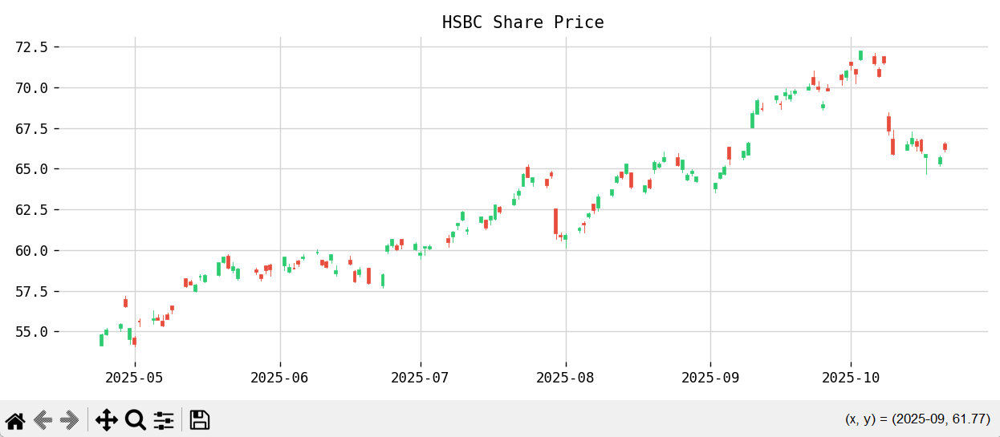

# Multi-AI Agent System

This project is a multi-agent AI system that dynamically selects between internal data analysis, financial stock data from APIs, and web scraping tools based on user questions. There are 4 agents that communicate their outputs with each other, `planner_agent.py`, `researcher_agent.py`, `data_analyst_agent.py`, `information_retrieval_agent.py`, using Llama-3 8B and Gemma-3 4B, to generate structured, up-to-date insights.

### Example:




Question: *Based on the sales data, benchmark this against our competitors in the UK financial sector, researching recent financial news, and getting real-time stock data from Yahoo Finance API to provide a comprehensive summary.*

Data: *`data/sales_data.csv`*

### Output:

Based on the available data, the company demonstrates consistent revenue growth with a total revenue of $64,000 over the past four quarters, averaging $16,000 per quarter.

The key stock metrics for the tracked companies are as follows:

UBS: Symbol: UBS, Last Price: 41.32, Market Cap: 131,730,634,260.36, Year High: 41.70, Year Low: 25.75, Shares Outstanding: None

HSBC: Symbol: HSBC, Last Price: 68.95, Market Cap: 238,366,348,259.40, Year High: 69.48, Year Low: 43.63, Shares Outstanding: None

The research highlights the growing application of Large Language Models (LLMs) like GPT and FinBERT within the financial sector, specifically in areas like sentiment analysis, financial reasoning, and time series forecasting. Palo Alto Networks (PANW) is a leading cybersecurity firm with a strong performance within the growth-oriented Information Technology sector. Recent trends indicate significant investment in data-driven stock forecasting models based on neural networks.

Reasoning:

I synthesized information from the provided CSV data, stock API calls (UBS & HSBC), and web scraping results. I extracted the key financial metrics for the listed stocks and incorporated relevant insights from the research papers on LLMs and stock forecasting models. The summary emphasizes trends, stock data, and research findings to provide a comprehensive overview.

Confidence: 0.98


### How to Run
1. *Clone the Repository*
   ```
   git clone https://github.com/yusuf-s-ahmed/Multi-AI-Agent-System.git
   cd ai-agents-prototype
   ```

2. *Install Dependencies*
   It is recommended to use a virtual environment. You can create one using:
   ```
   python -m venv venv
   source venv/bin/activate  # On Windows use `venv\Scripts\activate`
   ```
   Then install the required packages:
   ```
   pip install -r requirements.txt
   ```

3. Go to https://serpapi.com/ to create a free acount, then get an API key.

4. Create a `.env` file in the root directory, then add the Serp API key as shown:
   ```
   SERPAPI_KEY=<API-key-goes-here>
   ```
5. Download Ollama at https://ollama.com/download, run the `.exe` file.
6. Run the commands:
   ```
   ollama pull llama3:8b
   ```
      ```
   ollama pull gemma3:4b
   ```
   *Or any other LLM that your device can handler, smaller LLMs were used due to limited hardware capacity.*
7. Check the installation of the LLMs using:
   ```
   ollama list
   ```
   *You should see the LLMs you downloaded listed.*

3. Run the program:
   ```bash
   python src/orchestrator.py
   ```

### Project Structure

```
ai-agents-prototype
├── src
│   ├── agents
│   │   ├── data_analyst_agent.py        # Analyses input data 
│   │   ├── researcher_agent.py              # Conducts research by web scraping
|   |   └── information_retrieval_agent.py   # Fetches data using real-time APIs
|   |   └── planner_agent.py                 # Communicates with research, data analyst, info. retreival agents
│   │   └── __init__.py                      # Initializes the agents package
│   ├── helpers
│   │   ├── llm_utils.py        # Utility functions for interacting with the LLM
│   │   └── __init__.py         # Initializes the helpers package
│   ├── orchestrator.py          # Central logic for coordinating agent calls
│   └── __init__.py             # Initializes the main package
|
├── requirements.txt             # Lists project dependencies
├── README.md                    # Project documentation
└── .gitignore                   # Specifies files to ignore in version control
└── .env                         # File for storing sensitive API keys 
```


### Next Steps

There are many areas that could be improved, for example:
- Error handling to increase fault tolerance.
- Test and adjust the system by applying it to different domains: technology, e-commerce, etc. 
- Adding tools like Langchain, Hugging Face, MCP, etc.
- Fix final LLM output from executing orchestrator.py script.
- Make the planner agent's child agents execute in parallel using multithreading.
- Switch out Llama-3 8B and Gemma-3 4B for GPT-4 for rapid prototyping.
- Expose agents as Flask endpoints, to allow requests using Postman
- Recreate in Runa.

### License

This project is licensed under the MIT License. See the LICENSE file for details.